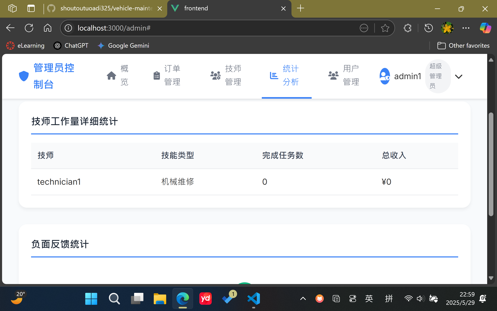
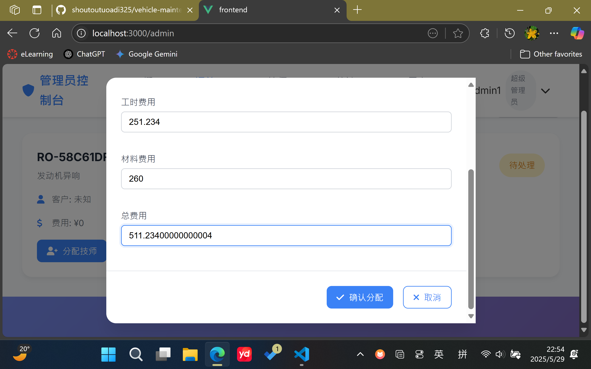
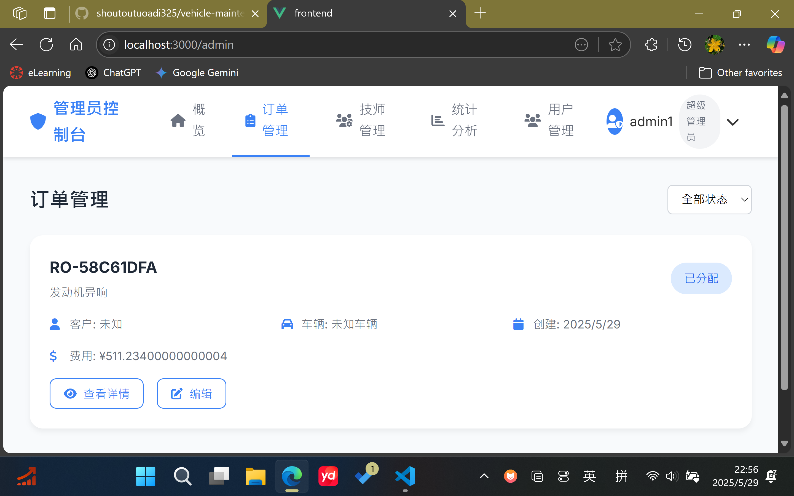

# 代码仓库地址
git clone https://github.com/shoutoutuoadi325/vehicle-maintenance-management-system.git
# E-R图（含表结构）

- 说明:

PK: Primary Key (主键)

FK: Foreign Key (外键)

||--o{ 表示一对多关系 (箭头指向“多”的一方)

}o--o{ 表示多对多关系 (通过一个中间连接表实现)

# 当前进度
- 订单完成后，超级管理员的查看报表数据没法同步

- 工时费的计算要改一下，改成计算用了多久时间来计算
- 材料费由技师来指定
- 超级管理员分配订单时浮点数计算问题

- 超级管理员订单详情无法显示用户信息和车辆信息

- 其他部分都已经完成了

# 前端运行时的注意事项
如果直接npm run serve失败：如果存在node_modules则删除这个文件夹及其中的所有内容，然后npm install之后再npm run serve即可